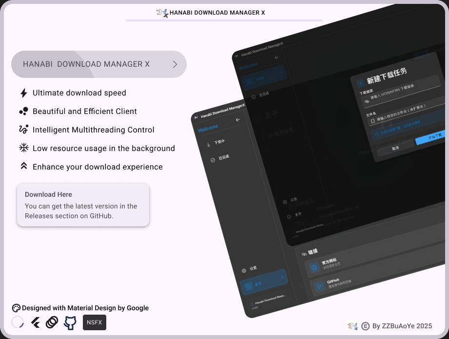

<div align="left">

# Hanabi Download Manager X

[](https://github.com/buaoyezz/Hanabi-Download-Manager-X/releases)

[](https://x.zzbuaoye.net)
[](https://x.zzbuaoye.net/web-notices.html)
[](https://github.com/buaoyezz/Hanabi-Download-Manager-X/releases)
[](docs/Menu.md)
[](https://zzbuaoye.net)

English | [中文](README_CN.md)

</div>



## Overview

Hanabi Download Manager X is a desktop download manager built with Flutter, focusing on multi-threaded downloads, resumable transfers, clear task status display, and a modern Windows desktop experience.

> [!NOTE]
> + This project mainly targets Windows 10/11. There are currently no plans to adapt it for other systems. Rounded corners, window effects, and tray behavior are all designed around the Windows desktop environment.
> + Due to API differences between Windows 11 and Windows 10, some abnormal behavior may still exist. If you encounter an issue, just report it in Issues.

> [!IMPORTANT]
> + This project involves a large amount of AI-assisted development, and a considerable part of the code was completed with AI assistance. If you run into funny quality issues, please open an Issue. Thanks. `If this is unacceptable to you, please do not use it.`
>
> + Due to limited personal time, direct PR submissions are not recommended. Issues are preferred for bug reports and suggestions.

## Quick Start

### Requirements

- Flutter SDK 3.0.0+
- Windows 10/11
- Git

### Run

```bash
git clone https://github.com/buaoyezz/hanabi-download-manager-x.git
cd hanabi-download-manager-x
flutter pub get
flutter run
```

### Sync Localization

```bash
dart run tool/sync_l10n.dart
```

`app_en.arb` can be automatically synced from `app_zh.arb`; Windows run and build scripts also execute this step before startup. However, this is strongly `not recommended`, because the machine translation is inaccurate and should only be used as a low-quality reference.

## Build

Recommended release script:

```bash
build_release.bat
```

You can also build directly with Flutter:

```bash
flutter build windows --release
```

> [!TIP]
> If you just want to quickly package an official release, prefer `build_release.bat`<br>It handles this project's extra Windows build steps and asset copying.

## Documentation DOCS

| Category | Document |
| --- | --- |
| Index | [Documentation menu](docs/Menu.md) |
| Plugins | [Plugin marketplace design](docs/plugin/PLUGIN_MARKET_DESIGN_CN.md) |
| Plugins | [Plugin API documentation](docs/plugin/PLUGIN_API_CN.md) |
| Plugins | [Plugin publishing flow](docs/plugin/PLUGIN_PUBLISH_FLOW_CN.md) |
| Plugins | [Plugin store signature design](docs/plugin/PLUGIN_STORE_SIGNATURE_CN.md) |
| Development | [Add a new language](docs/i18n/ADD_NEW_LANGUAGE.md) |
| Development | [Updater build](docs/UPDATER_BUILD_CN.md) |
| Development | [FAQ](docs/faq/FAQ.md) |

## Links

| Entry | URL |
| --- | --- |
| Official website | [x.zzbuaoye.net](https://x.zzbuaoye.net) |
| Project notices | [Web Notices](https://x.zzbuaoye.net/web-notices.html) |
| Releases | [GitHub Releases](https://github.com/buaoyezz/Hanabi-Download-Manager-X/releases) |
| Bug reports | [GitHub Issues](https://github.com/buaoyezz/hanabi-download-manager-x/issues) |
| Feature requests | [GitHub Issues](https://github.com/buaoyezz/hanabi-download-manager-x/issues) |
| Privacy policy | [Privacy Policy](https://x.zzbuaoye.net/privacy) |
| Terms of service | [Terms of Service](https://x.zzbuaoye.net/terms) |
| Personal homepage | [zzbuaoye.net](https://zzbuaoye.net) |

## License

This project is dual-licensed:

- **Core Application**: [GNU General Public License v3.0](LICENSE)
- **Plugins and SDK (`plugins/` directory)**: [MIT License](plugins/LICENSE)

> [!IMPORTANT]
> + As long as you use the provided MIT-licensed plugin APIs<br>You are free to develop open-source or closed-source plugins<br>They are `not affected` by the viral requirements of GPLv3

Copyright © 2026 [ZZBuAoYe](https://zzbuaoye.net)
