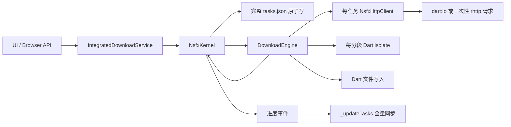
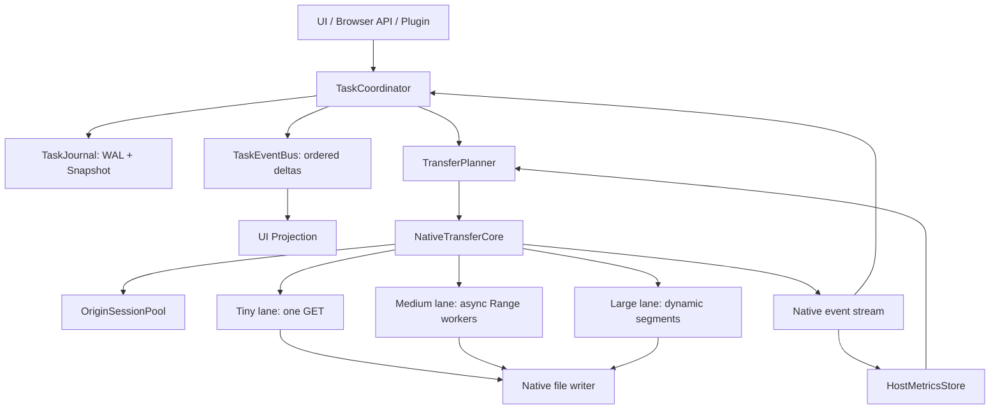

# Hanabi 下载核心 V2 架构设计

状态：设计冻结前草案  
日期：2026-07-19  
范围：HTTP/HTTPS 下载任务，不包含窗口效果、插件下载协议和更新器启动问题。

## 1. 结论先行

Hanabi 不需要推倒现有大文件能力，也不应该照搬 Ghost Downloader 3 的“小文件固定多路 Range”。V2 采用“控制面留在 Dart，数据面逐步下沉到常驻原生核心”的结构：

1. `TaskCoordinator` 只负责任务状态机、队列、重试和策略，不再持有具体 HTTP 客户端。
2. `NativeTransferCore` 常驻进程生命周期，持有连接池、请求取消句柄和文件句柄。
3. Tiny、Medium、Large 三条执行通道共享同一个原生 runtime，不为分段创建 Dart isolate。
4. `TaskJournal` 以追加日志接收任务变化，完整快照异步合并，不再在每次新增任务时序列化全部历史。
5. `TaskEventBus` 发布带序号的增量事件，UI 不再通过 `_updateTasks()` 全量回读来确认一次新增或进度变化。
6. 下载速度统一在“网络字节进入核心”的位置用单调时钟采样，UI 不再自行推算。

这次调整的首要目标不是提高理论带宽，而是消灭每个小文件都会重复支付的客户端创建、连接建立、isolate 调度、全量持久化和全量 UI 同步成本。

## 2. 已验证的性能事实

本地回环服务器、相同内容、无公网波动时，当前 Dart 引擎的实测结果如下：

| 文件大小 | 当前单连接 | 当前 4 路 | 当前 8 路 | 同机原生热连接基线 |
|---:|---:|---:|---:|---:|
| 64 KiB | 15.36 ms | 48.43 ms | 60.82 ms | 0.87 ms |
| 512 KiB | 18.82 ms | 43.66 ms | 63.62 ms | 3.81 ms |
| 2 MiB | 26.76 ms | 55.36 ms | 66.62 ms | 8.33 ms |

这些数据只能用于架构归因，不能直接代表公网下载速度。它们证明了三件事：

- 小文件瓶颈是固定成本，不是带宽上限。
- 给小文件增加 Dart isolate 和连接数会更慢。
- 64 KiB 的当前路径与热连接原生基线相差一个数量级，存在明确的架构优化空间。

补充的客户端生命周期基准进一步确认了连接池收益，也否定了“现有 rhttp 一定更快”的假设。以下是关闭测试日志干扰后的一次代表性复测：

| 文件大小 | Dart 冷客户端 | Dart 持久客户端 | rhttp 一次性客户端 | rhttp 持久客户端 |
|---:|---:|---:|---:|---:|
| 64 KiB | 2.68 ms | 1.48 ms | 2.37 ms | 2.74 ms |
| 512 KiB | 8.46 ms | 5.70 ms | 6.46 ms | 7.47 ms |
| 2 MiB | 25.81 ms | 18.40 ms | 23.34 ms | 17.80 ms |

该表测量到“完整读完响应 body”为止，不含任务状态机和最终文件提交。复测中 64 KiB 的持久 `rhttp` p50 在 2.01 ms 到 15.53 ms 之间波动，而热 `dart:io` p50 稳定在约 1.4 ms。当前 `rhttp` 的 FFI stream 不能直接作为 Tiny lane 的默认答案。连接池仍是必要条件，但 Phase 1 必须保留 Dart 与 rhttp 双 adapter 并按基准选路；最终性能目标依赖 Phase 3 的原生直写接口。

## 3. 当前架构的问题位置

当前主链路：



按影响排序的根因：

### P0：原生连接池实际没有跨任务复用

项目已经依赖 `rhttp 0.18.0`。该库的 `RhttpClient` 文档明确说明创建客户端代价高，并且客户端内部持有 Rust 连接池，应复用客户端。当前严格 HTTP 路径使用 `Rhttp.requestStream(settings: ...)` 一次性接口；普通自动模式则为每个任务创建 `NsfxHttpClient`，任务结束立即关闭。两条路径都无法稳定复用前一个小文件的 DNS/TCP/TLS/HTTP 会话。复用必须发生在统一 `OriginSessionPool` 中，但池内传输 adapter 由策略选择，不能强制全部改成 rhttp。

### P0：数据面仍跨 Dart 边界

即使使用 `rhttp`，响应块仍回到 Dart，再由 `IOSink` 或 `RandomAccessFile` 写入。最终架构若要逼近或超过 IDM/GD3，小文件与分段写入必须支持原生 `downloadToFile` 和原生 offset write，避免每块数据经过 FFI、Dart stream 和 Dart 文件 API。

### P1：多分段以 isolate 为 worker

每个分段创建 isolate、端口、客户端和控制消息。这个模型适合 CPU 隔离，不适合大量异步网络 I/O。GD3 的 subworker 共享一个常驻 asyncio runtime；Hanabi V2 对应地应让所有 Range worker 共享一个常驻原生异步 runtime。

### P1：任务持久化是全量快照

新增任务会捕获全部任务、编码 JSON、原子替换文件。传输已经可以与写盘并行，但 API 成功确认仍等待完整写入，任务数量越多，新增小文件的尾延迟越高。

### P1：控制面仍有全量同步

`IntegratedDownloadService.addTask()` 成功后调用 `_updateTasks()`，重新拉取并比较全部任务。任务事件已经存在，但没有成为唯一事实流。

### P2：策略以硬阈值为主

`< 1 MiB`、`5 MiB` 最小分段和 `8 MiB` 已知大小快速路径解决了部分问题，但无法表达 RTT、TTFB、主机历史吞吐、HTTP 版本、Range 质量及服务器限流差异。

## 4. GD3 中值得采用和不应照搬的部分

| 项目 | GD3 | Hanabi V2 决策 |
|---|---|---|
| 浏览器元数据 | 有大小/Range 信息时跳过探测 | 采用，现有 `expectedSizeHint` 继续扩展为完整 `ResourceHint` |
| worker 模型 | 常驻 asyncio 线程内运行 subworker | 采用思想，映射为一个常驻 Rust async runtime |
| 小文件并发 | 可按 subworkerCount 固定切分 | 不照搬，只有收益模型为正才并发 |
| 文件预分配 | 稀疏预分配 | 采用，但由写入策略根据磁盘类型和文件大小决定 |
| Windows 写入 | `WriteFile + OVERLAPPED` | 采用等价原生 offset write，不要求复制具体实现 |
| 任务持久化 | 200 ms 合并写 | 采用“合并写”思想，但增加带 CRC 的 WAL 以保证崩溃恢复 |
| 无元数据探测 | Range 探测，失败再降级 | 保留为恢复/未知资源路径；新任务优先真实 GET 并按响应头晋升 |

## 5. 目标架构



### 5.1 控制面：TaskCoordinator

职责：

- 生成 task id，执行目录和文件名冲突检查。
- 管理 `pending -> running -> paused/completed/failed/cancelled` 状态机。
- 管理全局、主机和任务级预算。
- 调用 `TransferPlanner`，把不可变 `TransferSpec` 交给原生核心。
- 消费原生事件并更新任务投影。

明确不负责：创建 HTTP 客户端、读取响应流、写文件、启动 isolate、计算瞬时速度。

### 5.2 数据面：NativeTransferCore

第一阶段建立统一会话池，池内同时支持复用的 `dart:io HttpClient` 与 `rhttp.RhttpClient`；第二阶段提供 Hanabi 自有的原生文件传输接口。核心生命周期与应用内核一致，而不是与任务一致。

建议接口：

```text
initialize(CoreConfig) -> CoreHandle
enqueue(TransferSpec) -> TransferHandle
pause(TransferHandle) -> Checkpoint
resume(TransferHandle, Checkpoint)
cancel(TransferHandle, deletePartial)
updateLimits(LimitConfig)
events(CoreHandle) -> Stream<NativeTransferEvent>
shutdown(gracePeriod)
```

`TransferSpec` 至少包含 URL、请求头、目标路径、已知大小、validator、代理身份、HTTP 版本策略、限速、恢复 checkpoint 和规划结果。请求级取消句柄必须独立，暂停一个任务不能销毁整个 Origin 的连接池。

### 5.3 OriginSessionPool

池 key 只包含影响底层连接复用的字段：

```text
scheme + host + port
+ proxy identity
+ TLS verification/profile
+ HTTP version preference
+ DNS override/profile
```

Cookie、Referer、Range、普通 Header 和任务 id 都是请求级数据，不进入池 key。默认空闲回收建议 90 秒；全局和单 Origin 连接上限由调度器动态调整。配置变化只淘汰受影响的池，不重建全部网络状态。

### 5.4 三条执行通道

#### Tiny lane

- 一个原生 GET，不探测，不启动 isolate。
- 复用 Origin session。
- 直接写 `.hdmx.partial`，完成后原子 rename。
- 已知很小且磁盘允许时可使用有限内存缓冲，但默认仍直接写文件，避免内存峰值。

#### Medium lane

- 在同一个原生 async runtime 内运行 1 到 4 个 Range 请求。
- 每个请求使用原生 offset write 写同一个预分配文件。
- 不产生 part 文件，不需要下载完成后的全文件合并。
- 服务端限流、Range 异常或实际收益不足时可在运行中收敛到更少连接。

#### Large lane

- 保留当前动态分段、validator、暂停恢复、校验和故障降级语义。
- 第一阶段仍可调用现有 Dart 大文件引擎；待 Tiny/Medium 稳定后再迁移 worker 和写入。
- 迁移前后 checkpoint 格式版本化，旧任务必须可恢复或明确安全降级为单连接续传。

## 6. 自适应规划，不再只有文件大小阈值

规划器输出不可变决策：

```text
TransferPlan {
  lane
  probePolicy
  connectionCount
  segmentSize
  preallocationMode
  transportPreference
  reasonCodes[]
}
```

输入包括：

- 浏览器或 API 提供的大小、文件名、Range、ETag、Last-Modified。
- 当前 Origin 的 RTT、TTFB、握手成本、历史单连接吞吐和并发增益。
- HTTP/1.1、HTTP/2、HTTP/3 的实际协商结果。
- 服务器错误率、429/5xx、Range 可信度和已学习并发上限。
- 当前全局连接预算、磁盘队列压力和用户限速。

初始决策规则不是永久阈值，而是冷启动先验：

- 已知小文件直接 Tiny。
- 未知新任务先发真实 GET；收到响应头后，只有预计并发节省时间大于 `max(2 * RTT, 150 ms)` 才晋升。
- 有部分数据的任务先验证恢复条件，不使用“取消首个 GET 再重开多路”的激进晋升。
- HTTP/2/3 同一连接上的多 stream 与 HTTP/1.1 多连接分别计费，不能都按“线程数”表达。

Host 指标使用有过期时间的 EWMA。每次决策保存 `reasonCodes`，以便 UI 诊断和自动测试复现。

## 7. 持久化：TaskJournal

文件结构：

```text
tasks.snapshot.json
tasks.journal
host_metrics.snapshot.json
```

`tasks.journal` 使用长度前缀、版本号、sequence 和 CRC 的追加记录。事件至少包括 `TaskCreated`、`StateChanged`、`CheckpointAdvanced`、`TaskRemoved`。新增任务流程：

1. 内存接收任务并立即启动网络规划。
2. 同时追加轻量 `TaskCreated`。
3. API 只等待该条 journal 被接受，不等待全部任务快照重写。
4. journal 达到大小/条数/时间门槛时后台生成新 snapshot 并截断已合并日志。

高频进度不逐块写 journal。checkpoint 按时间与字节双阈值合并；完成、暂停和失败立即写状态事件。崩溃恢复按 snapshot sequence 加 journal 重放，CRC 失败只丢弃尾部不完整记录。

## 8. 事件与 UI 投影

统一事件格式：

```text
TaskDelta {
  sequence
  taskId
  changedFields
  monotonicTimestampMicros
}
```

`IntegratedDownloadService` 维护本地投影：新增任务直接插入；进度只改对应 task；删除只移除对应 id。只有内核重连、sequence 缺口或恢复失败时才调用一次全量 `getTasks()`。这样任务数不会影响单个小文件的 UI 确认延迟。

## 9. 可靠速度模型

速度必须由核心按真实接收字节计算，禁止由 UI 的刷新间隔反推：

- `wireBytes`: 网络层实际接收的 body 字节。
- `committedBytes`: 已提交给文件写入器的字节。
- `activeTransferMicros`: 排除排队、暂停、重试退避和用户限速等待后的活动时间。
- `instantBps`: 250 ms 样本的 EWMA，仅用于正在下载。
- `windowBps`: 最近 2 秒滑动窗口，用于稳定显示。
- `averageBps`: `wireBytes / activeTransferMicros`，用于完成统计。

小于一个采样窗口就完成的文件不展示伪造的瞬时速度；完成事件给出精确平均速度和端到端耗时。每个阶段记录：提交、首请求、响应头、首字节、首次写入、网络完成、文件提交、journal 完成和 UI 投影完成。

## 10. 迁移顺序

### Phase 0：测量基线

- 固化 64 KiB、512 KiB、2 MiB、16 MiB 基准。
- 增加冷/热 Dart client、一次性/持久 `RhttpClient` 对照。
- 增加阶段时间线，不改变生产行为。

### Phase 1：常驻会话与请求级取消

- 新增 `OriginSessionPool`，同时提供 Dart 与 rhttp session adapter。
- Tiny HTTP/1.1 冷启动默认使用实测更稳定的热 `dart:io` 池；HTTP/2、HTTP/3 和其他场景由策略/基准选择 adapter。
- 每任务保存请求句柄；Dart adapter 使用请求级 abort，rhttp adapter 使用 `CancelToken`，任务完成不 dispose session。
- 自动 HTTP 策略进入可复用会话，失败时保留当前降级链。
- 先替换 Tiny lane；大文件路径保持原样。

### Phase 2：journal 与增量事件

- `TaskJournal` 双写旧 snapshot，验证恢复一致后切换读取顺序。
- `TaskEventBus` 驱动 UI 投影；保留全量同步作为修复通道。
- 移除新增任务后的强制 `_updateTasks()`。

### Phase 3：原生直写 Tiny/Medium

- 增加 `downloadToFile`、预分配和 offset write。
- Medium worker 迁到单一 native runtime。
- 逐步禁用分段 isolate，仅保留 feature flag 回滚。

### Phase 4：迁移 Large lane

- 兼容旧 checkpoint 后迁移动态分段、续传和校验。
- 达到回归门槛后删除重复 Dart 数据面。

## 11. 发布门槛

本地回环基准建议门槛：

- 64 KiB 热连接 p50 不高于 3 ms，p95 不高于 6 ms。
- 512 KiB 热连接 p50 不高于 7 ms。
- Tiny lane 相比当前单连接至少降低 60% 端到端延迟。
- 4 路/8 路不得成为 2 MiB 以下自动策略的默认选择。

公网与稳定性门槛：

- HTTPS 同 Origin 连续小文件批量、不同 Origin 批量、代理、系统代理、HTTP/2、HTTP/3 各自有回归用例。
- 暂停/恢复、进程强杀恢复、ETag 变化、错误 Content-Range、服务端忽略 Range 不产生静默损坏。
- 大文件吞吐相对当前版本下降不得超过 3%，CPU 和内存不得显著上升。
- 所有性能测试后台运行，不启动主窗口、不抢焦点。

## 12. 代码落点

建议新增：

```text
lib/services/kernel/next/coordinator/task_coordinator.dart
lib/services/kernel/next/planner/transfer_planner.dart
lib/services/kernel/next/events/task_event_bus.dart
lib/services/kernel/next/storage/task_journal.dart
lib/services/kernel/next/native/native_transfer_core.dart
lib/services/kernel/next/native/origin_session_pool.dart
native/hanabi_transfer_core/                 # Phase 3 起
```

现有文件调整边界：

- `nsfx_kernel.dart`：退化为 facade，委托 coordinator。
- `download_engine.dart`：Phase 1 仅保留 Large legacy adapter，之后逐步删除数据面职责。
- `http_client.dart`：Phase 1 拆为请求模型、策略降级和 session adapter。
- `task_storage.dart`：保留配置与迁移，任务状态交给 journal。
- `integrated_download_service.dart`：消费 delta 投影，仅在事件缺口时全量同步。

## 13. 明确禁止的回归方向

- 不用更多 Dart isolate 修复小文件性能。
- 不对所有小文件固定开启多路 Range。
- 不在任务完成时销毁共享 Origin session。
- 不把网络字节、落盘字节和 UI 进度混为同一个速度样本。
- 不一次性替换已经稳定的大文件恢复链路；每条 lane 独立 feature flag、独立基准、可回滚。
